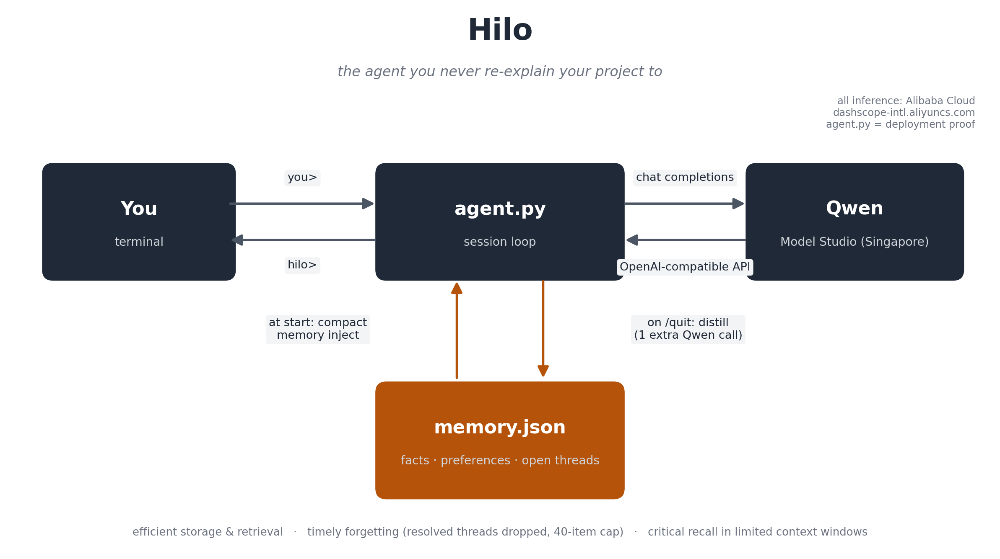

# Hilo

**The agent you never re-explain your project to.**

Brief Hilo once. When you leave — `/quit`, or even Ctrl+C — one extra Qwen call
distills the whole session into structured memory. The next session opens with
your project already loaded and picks up exactly where you left off.

Built for the **Global AI Hackathon Series with Qwen Cloud — Track 1: MemoryAgent**.
All inference runs on **Qwen via Alibaba Cloud Model Studio** (DashScope
international OpenAI-compatible endpoint). [`agent.py`](agent.py) is the
deployment-proof file: every model call in it goes to Alibaba Cloud.

## Why it fits the track

| Judges' focus | Hilo design decision |
|---|---|
| **Efficient memory storage and retrieval** | On session end, one distillation call compresses the entire transcript into compact structured memory — `facts`, `preferences`, `open_threads` — in `memory.json` |
| **Timely forgetting of outdated information** | Distillation drops resolved threads and rewrites stale facts instead of appending; a hard 40-item cap prunes oldest-first as backstop |
| **Recalling critical memories within limited context windows** | New sessions inject only the compact memory block plus recent turns — never past transcripts — so recall costs hundreds of tokens, not a context window |

## Architecture



One loop, one data flow, one output: `agent.py` runs the session against Qwen;
`memory.py` owns distillation, timely forgetting, and crash-safe atomic saves.

## Quickstart (5 commands)

```bash
git clone https://github.com/phazon2/hilo.git && cd hilo
cp .env.example .env          # Windows: copy .env.example .env   — then paste your key into .env
python -m venv .venv && source .venv/bin/activate    # Windows: .venv\Scripts\activate
pip install -r requirements.txt
python test_connection.py     # GREEN? then: python agent.py
```

## Configuration (`.env`)

| Variable | Default | Meaning |
|---|---|---|
| `DASHSCOPE_API_KEY` | — | Model Studio key from the **Singapore** console (`modelstudio.console.alibabacloud.com/ap-southeast-1`) |
| `QWEN_MODEL` | `qwen-turbo` | Any chat model in your catalog. If it fails, `test_connection.py` finds a working one and prints the line to paste |
| `QWEN_BASE_URL` | `https://dashscope-intl.aliyuncs.com/compatible-mode/v1` | International endpoint. Never the Beijing one |
| `HILO_MEMORY_FILE` | `memory.json` | Where memory lives (gitignored — memory is yours, not the repo's) |

## In-session commands

| Command | Effect |
|---|---|
| `/facts` | Show everything Hilo currently remembers |
| `/save` | Checkpoint memory mid-session (distill + atomic save) |
| `/quit` | End session: distill, save, exit |
| `Ctrl+C` | Same as `/quit` — interruption still saves memory. A crash can't make Hilo forget |

## Why so small — the design rationale

Hilo is ~400 lines on purpose. In a memory track, the scarce resource is the
context window, and the honest metric is **what recall costs**. Measured on this
repo's own live demo session (chars/4 ≈ tokens):

| Recall strategy | Cost at session start | Growth over sessions |
|---|---|---|
| Replay full history (naive) | ~330 tokens after *one short demo session* | unbounded — O(everything ever said) |
| **Hilo's distilled memory block** | **~90 tokens** for the same session | **capped** — ≤40 items, resolved threads dropped, stale facts rewritten |

The other deliberate choice is that memory is **unbreakable by construction**:
atomic writes (temp file + rename), corrupt files quarantined instead of crashing,
a failed distillation degrades memory to *unchanged* — never to *corrupted* — and
Ctrl+C anywhere still saves. A memory agent you can't trust to keep its memory
isn't a memory agent.

Every claim above is executable, not aspirational: `python test_offline.py`
(13 checks, no key needed) and the CI workflow re-proves the live
brief→restart→resume loop against Qwen on every push.

## Tests

```bash
python test_offline.py     # no key, no network: memory engine end to end
python test_connection.py  # live smoke test against Qwen on Alibaba Cloud
```

CI runs both (`.github/workflows/smoke.yml`); the live job activates when a
`DASHSCOPE_API_KEY` repo secret exists, and archives a scripted
brief-then-resume demo transcript as a build artifact.

## Troubleshooting

- **RED: 401 auth failed** — re-paste the key into `.env` (no quotes/spaces). The key must come from the Singapore console; Beijing-console keys do not work internationally.
- **Model not found** — the catalog rotates. `test_connection.py` auto-tries fallbacks and prints the `QWEN_MODEL=` line to put in `.env`.
- **`python` not found (Windows)** — try `py`.
- **venv activation policy error (Windows)** — use plain `cmd`, or call `.venv\Scripts\python` directly.
- **Wrong console** — never use `bailian.console.alibabacloud.com` (Beijing; demands Chinese real-name authentication). Always `modelstudio.console.alibabacloud.com/ap-southeast-1`.

## License

[MIT](LICENSE)
